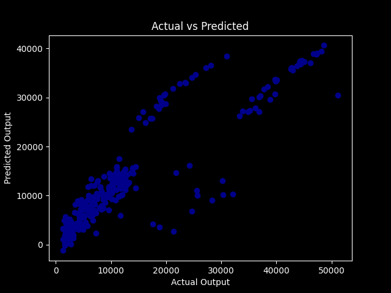

#  Health Insurance Charges Prediction

This project applies **Linear Regression** to predict medical insurance charges based on personal and lifestyle factors.

 

## Dataset
- **Source**: [Kaggle – Medical Cost Personal Dataset](https://www.kaggle.com/datasets/mirichoi0218/insurance)  
- **Features**:
  - `age` – Age of the primary beneficiary  
  - `sex` – Male / Female  
  - `bmi` – Body mass index  
  - `children` – Number of children covered by insurance  
  - `smoker` – Smoking status  
  - `region` – Residential area in the US  
- **Target**: `charges` – Individual medical costs billed by health insurance  

 

## Steps
1. Encoding categorical variables
2. Splitting into train/test sets  
3. Training a Linear Regression model  
4. Model evaluation using **R² score**  
5. Visualization of **Actual vs. Predicted** charges 

 

## Results
- **R² score**: ~0.78 (varies by split)  
- Sample predictions:
  - 20-year-old non-smoker → *2859.60792468*  
  - 50-year-old male, BMI 35 → *11262.64453948*  

 

## Tech Stack
- Python  
- Pandas, NumPy  
- Scikit-learn  
- Matplotlib  

 

## Media
### Accuracy Visualization

