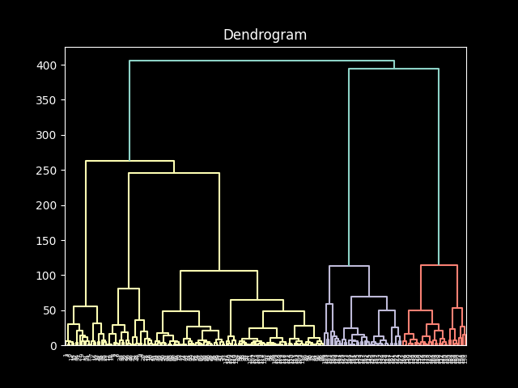
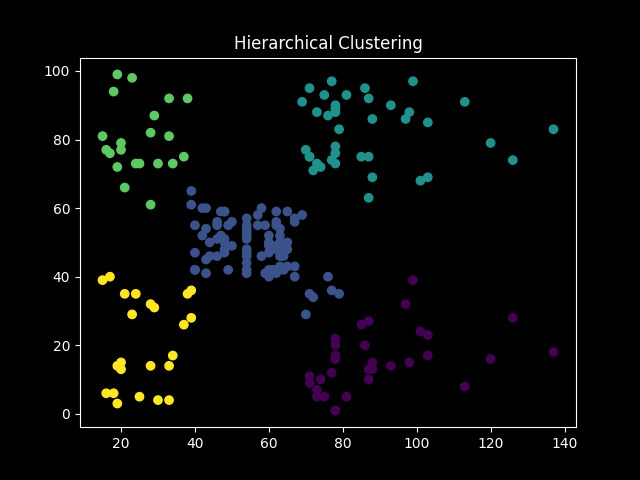

# Mall Customers (Hierarchical Clustering)

This project uses **Agglomerative Hierarchical Clustering** to segment mall customers based on their annual income and spending score.

 

## Dataset
- **Source:** [Mall Customers Dataset](https://www.kaggle.com/datasets/shwetabh123/mall-customers)  
- **Features:** `Annual Income (k$)`, `Spending Score (1–100)`  
- **Objective:** Group customers with similar purchasing behavior to support targeted marketing strategies.

 

## Methodology
1. Loading and explore the dataset  
2. Analyze dendrogram to determine an appropriate number of clusters (selected 5)  
3. Applying Agglomerative Clustering 
4. Visualizing resulting customer segments  

 

## Results
-  number of clusters: 5  
- Clear visualization of distinct customer segments included  

 

## Tech Stack & Python Libraries
-   Pandas
-   Numpy
-   Scikit-learn
-   Matplotlib
-   SciPy

 

## Media

### Dendrogram

### Scatter visulization of clustering

