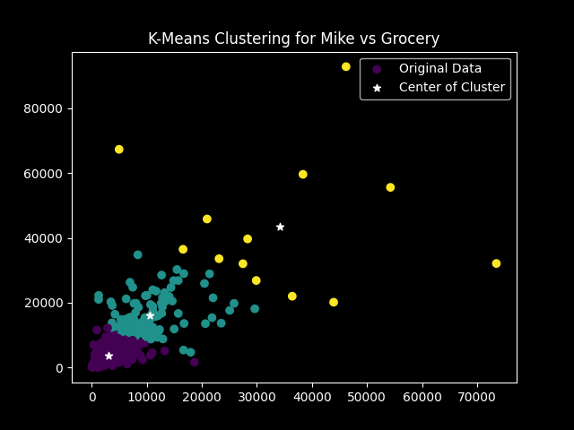

# Wholesale Customers (K-Means Clustering)

This project uses **K-Means Clustering** to segment wholesale customers based on their annual spending on Milk and Grocery products.

 

## Dataset
- **Source:** [Wholesale Customers Dataset](https://www.kaggle.com/datasets/binovi/wholesale-customers-data-set)  
- **Features used:**  
  - `Milk`  
  - `Grocery`  
- **Objective:** Identify distinct customer groups based on purchasing patterns.

 

## Methodology
1. Loading and exploring the dataset  
2. Selecting two features (Milk and Grocery) from the available four to simplify and visualize the clustering results.
3. Apply K-Means Clustering with `k = 3`  
4. Visualizing the clusters and their centroids  

 

## Results
- Customers are grouped into three clear segments 
- Cluster centers are shown with white stars (`*`)
- And the visualization highlights differences in purchasing behavior.

 

## Tech Stack & Python Libraries
- Pandas
- Numpy
- Scikit-learn
- Matplotlib

 

## Visualization

